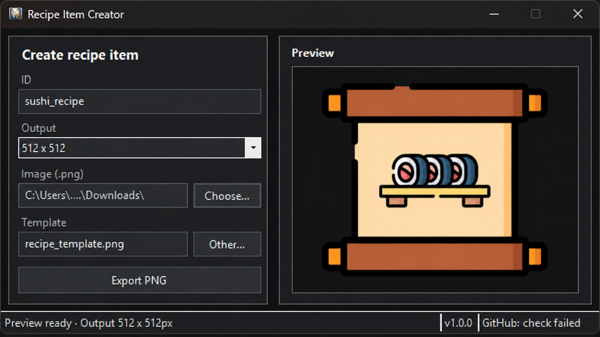

# Recipe Item Creator

A lightweight Windows desktop tool for creating recipe-item images from a reusable template.

It is designed primarily for game-server and modding workflows such as FiveM, where recipe or crafting items need a consistent visual style.

## Preview



## Features

- Create recipe-item images from a reusable template
- Load PNG, JPG/JPEG, and WebP images
- Automatically detect and trim transparent image areas
- Scale and position item images inside the recipe area
- Live preview before exporting
- Export clean PNG files in multiple resolutions
- Drag-and-drop support for item images
- Custom recipe template support
- Dark Windows title bar
- Built-in application version display
- GitHub release update check
- No GitHub token required for public repositories
- Portable single-file Windows build
- No installer required

## Download

Prebuilt versions are available from the GitHub Releases page:

https://github.com/xoxttxox/RecipeItemCreator/releases

The recommended download is:

```text
RecipeItemCreator.exe
```

The standalone build contains everything required to run the application.

No installer is required.

## System Requirements

### Prebuilt standalone release

- Windows 10 or Windows 11
- 64-bit Windows
- No separate .NET installation required

### Development

- Windows
- .NET 10 SDK
- Visual Studio 2022 or newer, or another compatible .NET IDE

## Usage

1. Start `RecipeItemCreator.exe`.
2. Enter or confirm the item ID.
3. Select the desired output resolution.
4. Choose an item image or drag it onto the preview area.
5. Optionally select a custom recipe template.
6. Check the preview.
7. Click **Export PNG**.
8. Choose the destination for the generated image.

For item images, PNG files with transparent backgrounds are recommended.

## Supported Image Formats

The application uses SkiaSharp for image decoding.

Supported formats include:

- PNG
- JPG
- JPEG
- WebP

Other formats supported by SkiaSharp may also work, but the formats above are the intended input formats.

## Output Sizes

The application currently supports:

```text
128 x 128
256 x 256
512 x 512
```

The preview is rendered independently from the selected export resolution.

## Building the Project

Clone the repository and restore the dependencies:

```bash
git clone https://github.com/xoxttxox/RecipeItemCreator.git
cd RecipeItemCreator
dotnet restore
```

Build the project:

```bash
dotnet build -c Release
```

## Publishing a Single EXE

The project is intended to be distributed as a standalone Windows x64 executable.

Recommended publish command:

```bash
dotnet publish RecipeItemCreator.csproj -c Release -r win-x64 --self-contained true \
  /p:PublishSingleFile=true \
  /p:IncludeNativeLibrariesForSelfExtract=true \
  /p:EnableCompressionInSingleFile=true \
  /p:PublishReadyToRun=false \
  /p:PublishTrimmed=false \
  /p:DebugType=None \
  /p:DebugSymbols=false \
  -o publish
```

On Windows, the included `publish.bat` can be used instead.

After publishing, the distributable application is:

```text
publish/
└── RecipeItemCreator.exe
```

Only the EXE needs to be attached to the GitHub release.

## GitHub Update Check

Recipe Item Creator can check the latest published GitHub release and notify the user when a newer version is available.

The repository URL is configured in:

```text
Configuration/AppSettings.cs
```

Example:

```csharp
public const string GitHubRepositoryUrl =
    "https://github.com/xoxttxox/RecipeItemCreator";
```

For a public GitHub repository, no authentication token is required for the standard release check.

The application requests:

```text
https://api.github.com/repos/xoxttxox/RecipeItemCreator/releases/latest
```

and compares the latest release tag with the current application version.

## Versioning

The project uses standard version numbers in the following format:

```text
Major.Minor.Patch
```

Examples:

```text
1.0.0
1.0.1
1.1.0
2.0.0
```

GitHub release tags should use the `v` prefix:

```text
v1.0.0
v1.0.1
v1.1.0
v2.0.0
```

The application automatically handles the leading `v` when comparing versions.

A typical project configuration is:

```xml
<PropertyGroup>
  <Version>1.0.0</Version>
  <AssemblyVersion>1.0.0.0</AssemblyVersion>
  <FileVersion>1.0.0.0</FileVersion>
</PropertyGroup>
```

## Creating a Release

Recommended release workflow:

1. Update the project version.
2. Build and test the application.
3. Run the standalone publish script.
4. Test the generated `RecipeItemCreator.exe`.
5. Commit and push the changes.
6. Open **GitHub → Releases → Draft a new release**.
7. Create a tag such as `v1.0.0`.
8. Use a release title such as `Recipe Item Creator v1.0.0`.
9. Attach `RecipeItemCreator.exe`.
10. Add release notes.
11. Publish the release.

The built-in update checker uses the latest published GitHub release.

## Project Structure

```text
RecipeItemCreator/
├── Configuration/
│   └── AppSettings.cs
├── Controls/
│   └── DarkTextBox.cs
├── Forms/
│   ├── MainForm.cs
│   ├── MainForm.Designer.cs
│   └── MainForm.resx
├── Services/
│   ├── AppInfo.cs
│   ├── GitHubUpdateService.cs
│   ├── ImageComposer.cs
│   └── WindowsTheme.cs
├── Properties/
├── Resources/
├── assets/
│   └── preview.png
├── Program.cs
├── publish.bat
└── RecipeItemCreator.csproj
```

The exact project structure may change as the application evolves.

## Image Processing

Recipe Item Creator performs several steps when generating an output image:

- Loads the source image without keeping the original file locked
- Converts source images into an ARGB bitmap
- Detects the visible non-transparent image bounds
- Caches visible bounds for improved preview performance
- Fits the item image into the recipe paper area
- Prevents the item from drawing outside the intended recipe area
- Renders the final image with high-quality interpolation

## Security

Recipe Item Creator does not require GitHub credentials or access tokens for public release checks.

Do not embed private GitHub tokens, passwords, or other secrets in the application executable.

## License

This project is licensed under the MIT License.

See [LICENSE](LICENSE) for details.

## Author

Created and maintained by Pascal.

## Disclaimer

This project is provided as-is without warranty.

FiveM and other referenced products or trademarks belong to their respective owners.
